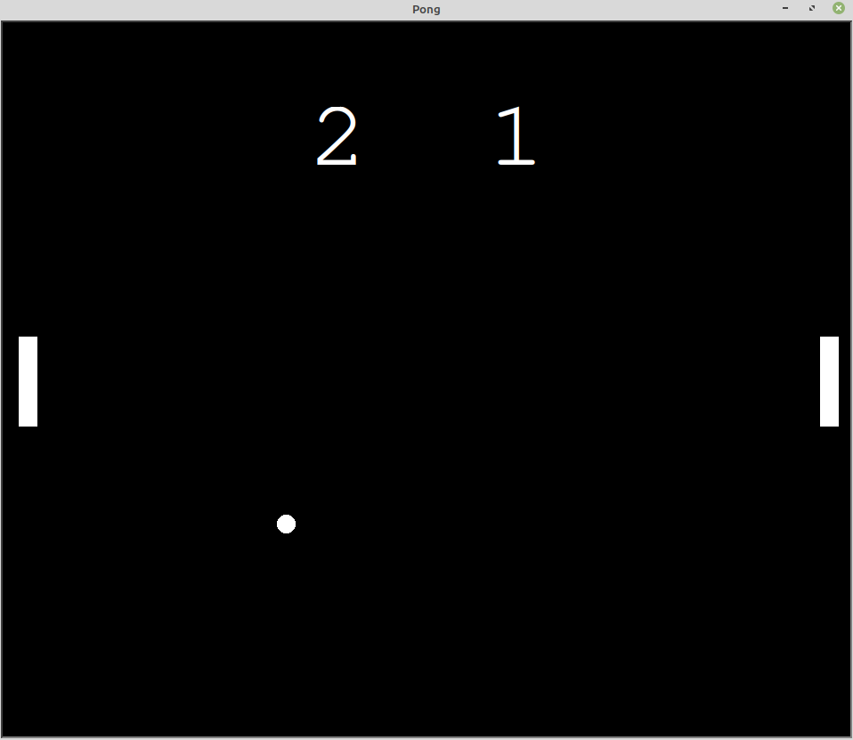

# Day22

## steps taken

- Create the paddles

- Move ball in any direction

- Add eventlistners to control the paddles movements

- Detect collision with the top and bottom walls

- Detect collision with the left and right paddles

- Detect paddle's miss to hit the ball and give a score to the other player


## Project to solidify material learned 

### Pong_game:
> Pong is a classic  acarde game, were a ball going across the table and two players each controlling a puddle and trying not to let the ball  touch the end of the players side of the screen.

#### Preview:




## How to run this on your device

- Clone this repository
```
git clone https://github.com/kingdreamerr/Day22_The_Pong_Game.git
```
- cd into the repo
```
cd Day22_The_Pong_Game
```

- Paste the following in the terminal 
```
python3 main.py
```
